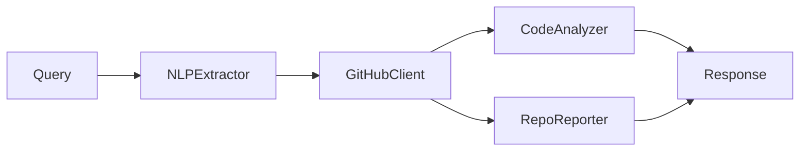

# GitHub Assistant 🤖

## Descrição
O GitHub Assistant é um agente especializado em análise e gestão de repositórios GitHub, oferecendo funcionalidades avançadas de análise de código, geração de relatórios e interação com repositórios.

## Funcionalidades

### 1. Operações Básicas
- Navegação em repositórios
- Leitura de arquivos
- Análise de PRs e Issues
- Informações de branches

### 2. Análise de Código
- Métricas de complexidade
- Detecção de problemas de segurança
- Análise de dependências
- Qualidade de código

### 3. Relatórios
- Atividade do repositório
- Métricas de código
- Análise de contribuições
- Tendências e insights

### 4. Resiliência
- Retry mechanism
- Circuit breaker
- Rate limiting
- Cache inteligente

## Uso

### Exemplos de Queries
```text
1. Análise de Arquivo
   "Analisa o arquivo src/main.py do github.com/user/repo"

2. Relatório de Repositório
   "Gera um relatório do github.com/user/repo"

3. Busca de Conteúdo
   "Mostra o conteúdo do arquivo README.md do github.com/user/repo"

4. Análise de PR
   "Detalhes do PR #123 do github.com/user/repo"
```

### Configuração
```python
config = {
    "github_token": "seu_token",
    "cache_ttl": 3600,
    "retry_attempts": 3
}
```

## Arquitetura

### Componentes Principais
1. `GitHubClient`: Cliente HTTP resiliente
2. `CodeAnalyzer`: Analisador de código
3. `RepoReporter`: Gerador de relatórios
4. `NLPExtractor`: Processamento de linguagem natural

### Fluxo de Dados


## Testes

### Unitários
```bash
pytest tests/agents/test_github_assistant.py
pytest tests/utils/test_nlp_extractor.py
pytest tests/utils/test_code_analyzer.py
```

### Integração
```bash
pytest tests/integration/test_github_integration.py
``` 