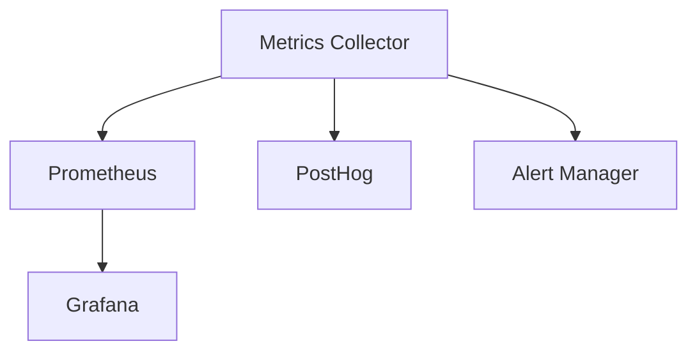
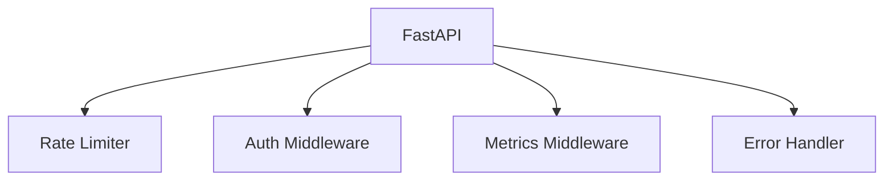
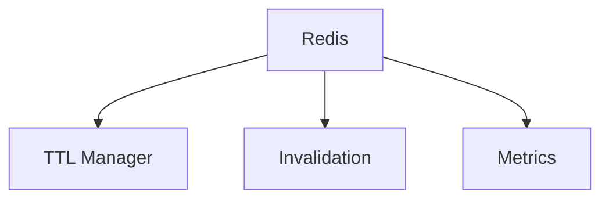

# Arquitetura do Sistema 🏗️

## Visão Geral

O Synapse Assistant é construído com uma arquitetura modular e escalável, focada em performance, confiabilidade e manutenibilidade.

## Componentes Principais

### 1. Sistema LLM ([detalhes](llm-system.md))

```mermaid
graph TD
    A[Cliente] --> B[API Gateway]
    B --> C[LLM Service]
    C --> D[DeepSeek API]
    C --> E[Redis Cache]
    C --> F[Vector Store]
    C --> G[Metrics]
```

### 2. Sistema de Analytics ([detalhes](analytics-system.md))

### 3. Sistema de API ([detalhes](api-system.md))

### 4. Sistema de Cache ([detalhes](cache-system.md))

## Fluxos de Dados

### Geração de Texto
1. Request chega via API
2. Validação e rate limiting
3. Verificação de cache
4. Se cache miss, chamada ao LLM
5. Armazenamento em cache
6. Coleta de métricas
7. Resposta ao usuário

### Processamento RAG
1. Recebimento de documento
2. Chunking e processamento
3. Geração de embeddings
4. Armazenamento em vector store
5. Recuperação por similaridade
6. Geração de resposta
7. Métricas e logs

## Monitoramento

### Métricas Coletadas
- **LLM:**
  - Latência
  - Tokens processados
  - Cache hits/misses
  - Erros

- **API:**
  - Requests por segundo
  - Latência
  - Status codes
  - Rate limits

- **Cache:**
  - Hit ratio
  - Memória utilizada
  - Evictions
  - TTL expirations

- **Sistema:**
  - CPU/Memória
  - Network I/O
  - Disk usage
  - Error rates

### Alertas
- Latência alta
- Error rate elevado
- Cache miss rate alto
- Recursos do sistema
- Rate limiting excessivo

## Escalabilidade

### Horizontal
- API stateless
- Cache distribuído
- Load balancing
- Message queues

### Vertical
- Otimização de recursos
- Cache tuning
- Connection pooling
- Query optimization

## Segurança

### Camadas
1. API Gateway
2. Rate Limiting
3. Authentication
4. Authorization
5. Input Validation
6. Output Sanitization

### Proteções
- Rate limiting
- Input validation
- SQL injection
- XSS prevention
- CSRF tokens

## Logs e Auditoria

### Log Levels
- ERROR: Erros críticos
- WARN: Avisos importantes
- INFO: Informações operacionais
- DEBUG: Detalhes para debugging

### Campos Padrão
- Timestamp
- Request ID
- User ID
- Operation
- Status
- Duration
- Metadata

## Recuperação de Falhas

### Estratégias
1. Circuit breaking
2. Retry with backoff
3. Fallback responses
4. Cache degradation
5. Service isolation

### Backup e Restore
- Database backups
- Configuration backups
- State recovery
- Log retention

## Manutenção

### Rotinas
- Log rotation
- Cache cleanup
- Metric aggregation
- Index optimization
- Resource scaling

### Deployment
- Blue/green deployment
- Canary releases
- Feature flags
- Rollback procedures

## Referências
- [Documentação da API](../api/README.md)
- [Guia de Desenvolvimento](../development/README.md)
- [Guia de Operações](../runbooks/README.md)
- [Métricas e Alertas](../monitoring/README.md) 